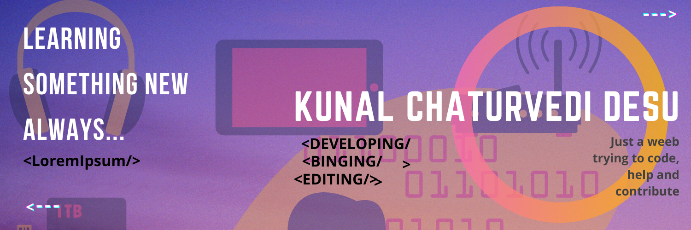

<h1 align="center">Hi 👋, I'm Kunal Chaturvedi</h1>
<h3 align="center">Just A Weeb Finding A Way Out Through Coding</h3>

  

- 🌱 I’m currently learning **WEB DEVELOPEMENT**

- 📫 How to reach me **kunalmanu2468@gmail.com**

- ⚡ Fun fact **I am short ... huh**

<h3 align="left">Connect with me:</h3>

<h3 align="left">Languages and Tools:</h3>

              

&nbsp;

